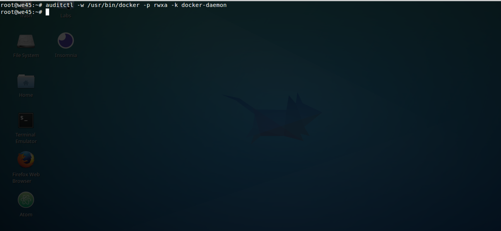
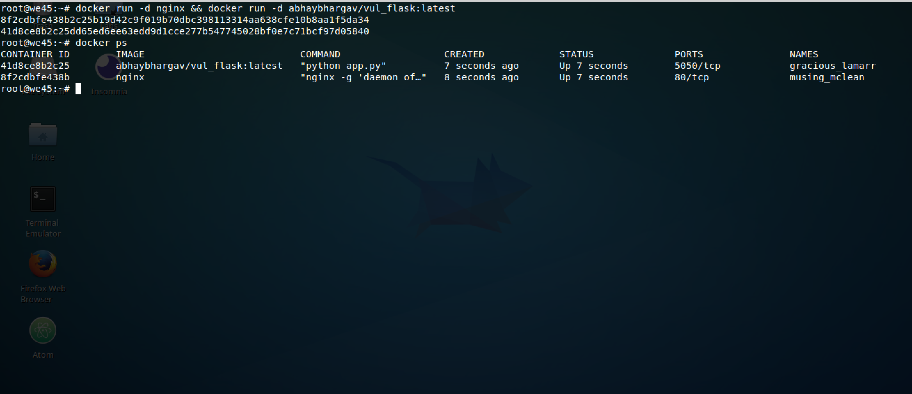
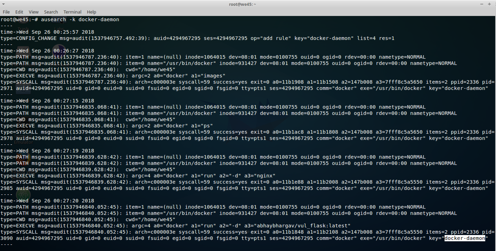

## Auditd for Docker monitoring

##### Step 1:

 * Run `service auditd status` to check if `auditd` service is running. If the service is not runninig, run `service auditd start`.

##### Step 2:

* Create an audit rule to watch for Read, Write, Execute and Attribute changes on `docker-daemon` logging them to a logfile by appending
docker-daemon label at end of each log-entry to make logs easier to query. This can be done by running:
    
    `auditctl -w /usr/bin/docker -p rwxa -k docker-daemon`
    
    * auditctl is for temporary use till system is shutdown. For a more permanent approach, add rule in rules.d/ and run 'augenriles --check'. 
      If there's a difference, run 'augenrules --load' to load the new rules 

##### Step 3:

* Create, Launch, Run and Stop a few containers for Auditd to log.

   
##### Step 4:

* To search logs based on the label given(`docker-daemon`), run `ausearch -k docker-daemon`.

    
##### Step 5:

* For a count of executable events run on system that day, run `ausearch --start today --raw | aureport -x --summary`

##### Step 6:

* Run `clean-docker` to stop all running containers